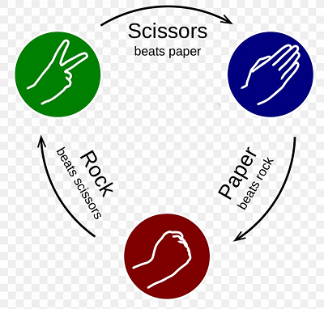

# rock-paper-scissors

### Play the [game](https://kiran0r0patil.github.io/rock-paper-scissors/) 

## ✊ 🖐 ✌

Learn JavaScript by Building Games **1**

---
Game rules:


JavaScript methods and properties used :
```
    .getElementById()
    .querySelectorAll()
    .forEach()
    .addEventListener()
    .innerHTML
    e.target.id
    Math.random()
    Math.floor()
```
